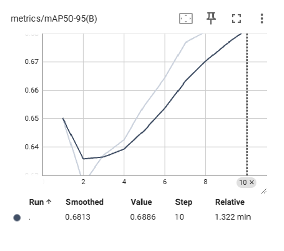

# YOLOv12 Object Detection

This task implements **YOLOv12** for object detection using **Ultralytics YOLO** framework. It involves training the model on the **COCO128 dataset**, visualizing results using TensorBoard and performing inference on images.

## Dataset
I used the **COCO128** dataset, a subset of the **COCO** dataset, which consists of 128 labeled images spanning 80 object categories. The dataset is structured as follows:

```
coco128/
│── 📁images/
│   ├──📁 train2017/
│──📁 labels/
│   ├──📁 train2017/
```

### Dataset Configuration (`data.yaml`)
```yaml
train: train.txt
val: val.txt
test: test.txt
nc: 80
names: ['person', 'bicycle', 'car', 'motorcycle', 'airplane', 'bus', 'train', 'truck', 'boat', 'traffic light', 'fire hydrant', ...]
```


##  Model Training
Train YOLOv12 on COCO128 dataset using the following command:
```bash
!yolo train model=yolov12.pt data=data.yaml epochs=10 imgsz=640 batch=4
```

### Training Logs and Metrics
I monitored training performance using TensorBoard:
- Epoch-wise Performance Graphs


- mAP (mean Average Precision)




- Precision


- Recall


- Loss Functions (Box Loss) Train


- Loss Functions (Class Loss) Train


- Loss Functions (DFL Loss) Train


- Loss Functions (Box Loss) Validation


- Loss Functions (Class Loss) Validation


- Loss Functions (DFL Loss) Validation


## Model Inference
Run inference on an image:
```bash
!yolo predict model=runs/detect/train7/weights/best.pt source=horses.jpg
```

**Example Output:**


## Results Summary
**Final Model Performance:**
| Metric  | Value |
|---------|--------|
| **mAP@50** | 0.851 |
| **mAP@50-95** | 0.689 |
| **Best Precision** | 0.848 |
| **Best Recall** | 0.779 |


## References
- [Ultralytics YOLO Documentation](https://docs.ultralytics.com/)
- [COCO Dataset](https://cocodataset.org/)

## Contact

For any questions or collaboration opportunities, feel free to reach out at [hey@njoguevans.me](mailto:hey@njoguevans.me).
